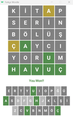
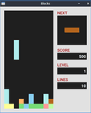

# 2D Games

## Oyunlar

### Wordle

#### golang

|                     | Wordle                                         |
|---------------------|------------------------------------------------|
| **Geliştirici**     | [Bora Akgün](https://github.com/QuickOrBeDead) |
| **Link**            | [Tıkla](wordle/golang)                |
| **Ekran Görüntüsü** |                    |

### Blocks

#### golang

|                     |Blocks                                           |
|---------------------|------------------------------------------------|
| **Geliştirici**     | [Bora Akgün](https://github.com/QuickOrBeDead) |
| **Link**            | [Tıkla](blocks/golang)                |
| **Ekran Görüntüsü** |                    |

### Snake

#### rustlang

|                     | Snake                                          |
|---------------------|------------------------------------------------|
| **Geliştirici**     | [Buğra Okumuş](https://github.com/bgraokmush)  |
| **Link**            | [Tıkla](snake/rustlang)               |
| **Ekran Görüntüsü** |                     |