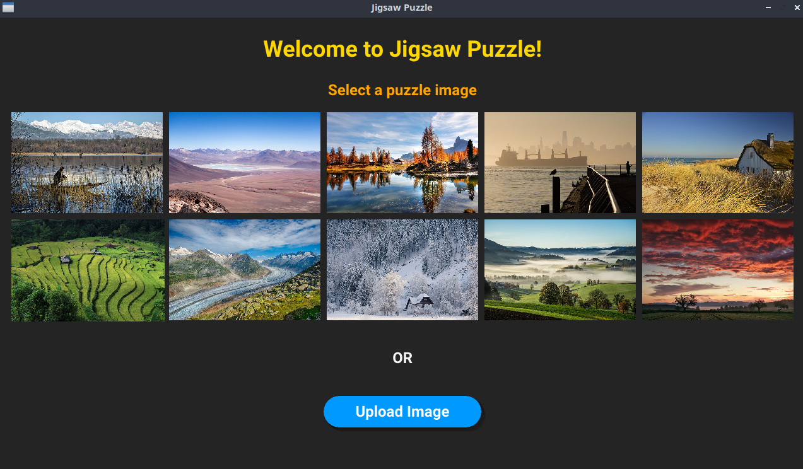
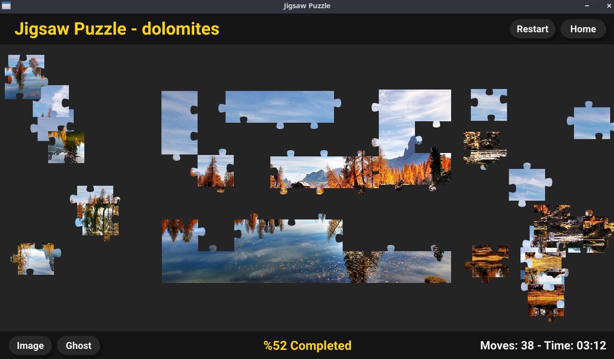

# Jigsaw Puzzle (Go / Ebiten)

Ebiten kullanılarak geliştirilen 2D bir yap‑boz (jigsaw puzzle) oyunu. JPG formatındaki hazır görselleri kullanabilir veya masaüstünüzden kendi resminizi yükleyip 48 parçalık bir bulmacaya dönüştürebilirsiniz.

## Özellikler
- 48 parçalık dinamik yap‑boz üretimi (en boy oranına göre optimum kolon/satır dağılımı)
- Parça kenar çıkıntılarının (tab) rastgele yön ve büyüklükte oluşması
- Parça grubu birleştikten sonra birlikte sürüklenebilme
- Otomatik hizalama (snap) toleransı (< 5px) ile pürüzsüz yerleşim
- Hareket (Moves) ve geçen süre takibi
- Tamamlanma yüzdesi gösterimi ve bitiş durum mesajı
- Önizleme (Image) modu: Orijinal resmin küçük ölçekli gösterimi
- Ghost modu: Arka planda yarı saydam tam resim kılavuzu
- FPS / TPS diyagramı (D tuşu ile aç/kapat) – performans gözlemi
- JPG resim yükleme (dialog kütüphanesi ile sistem dosya seçici)
- Responsive ölçek: Geniş resimler 600px genişliğe orantısal indirgenir
- Gölge (shadow) efekti: Sürüklenen veya kenarı açıkta kalan bölgelerde derinlik hissi
- Merkez odaklı hizalama ve parça gruplarını z‑index ile öne alma

## Ekran Görüntüleri
| Ana Ekran | Oyun Ekranı |
|-----------|-------------|
|  |  |

## Kurulum
### Gereksinimler
- Go 1.22+ (modül dosyası `go.mod` altında)
- Çalışma sistemi: Linux / macOS / Windows (Ebiten çoklu platform destekler)

### Bağımlılıklar
Önemli paketler:
- `github.com/hajimehoshi/ebiten/v2` – oyun döngüsü, çizim
- `github.com/tinne26/etxt` – metin render
- `github.com/sqweek/dialog` – yerel dosya seçici (resim yükleme)

(Go mod dosyası ile otomatik indirilecektir.)

### Derleme / Çalıştırma
```bash
go run ./src
# veya
go build -o jigsaw ./src && ./jigsaw
```

## Kontroller
- Sol tık: Parça veya parça grubu seç / sürükle
- Sol tık bırak: Parçaları bırak, hizalama tetiklenir
- Image düğmesi: Küçük orijinal önizleme aç/kapat
- Ghost düğmesi: Arka plan referans görseli aç/kapat
- Restart: Aynı görsel için yeni karışık başlangıç
- Home: Görsel seçme ekranına dön
- D: FPS/TPS diyagramını göster/gizle

## Resim Yükleme
1. Home ekranında "Upload Image" düğmesine tıklayın.
2. JPG / JPEG dosya seçin.
3. Resim otomatik ölçeklenir ve oyun sahnesi başlar.

Not: Yalnızca `.jpg` / `.jpeg` desteklenir. (İhtiyaç halinde PNG desteği eklenebilir.)

## Proje Yapısı
```
src/
  main.go                # Oyunun başlangıç noktası, pencere ayarı + sahne yönetimi
  common/                # Ortak yardımcılar (SceneManager, renkler, buton, metin, gölge vs.)
  scenes/
    homeScene/           # Görsel listeleme + kullanıcı yükleme arayüzü
    gameScene/           # Yap‑boz mantığı, parçalar, çizim ve UI düğmeleri
      puzzlePicture.go   # Parça üretimi, hizalama, gruplama, tamamlanma kontrolü
      puzzlePiece.go     # Tek parça geometrisi, mask oluşturma, kenar eğrileri
```

### Sahne Mimarisi
`SceneManager` basit bir arayüz (`Scene`) üzerinden Home ve Game sahneleri arasında geçiş sağlar. Her sahne:
- `Update` (oyun durum güncellemesi)
- `Draw` (render)
metotlarını uygular.

### Yap‑boz Parçaları
- Kenar çıkıntıları Bezier eğrileri ile oluşturulur (vector.Path)
- Mask + SourceIn blend ile parça görseli çıkarılır
- Komşuluk hesapları (üst, alt, sol, sağ) indeks tabanlıdır
- Z‑index yeniden ölçekleme ile en üstteki parça/gruppe görsel olarak öne alınır

### Parça Gruplama
Snapped parçalar `snappedPieces [][]int` içinde kümelenir. Yeni birleşmelerde:
1. İki parça veya grup kesişiyorsa kümeler birleştirilir
2. Grup sürüklenirken tüm üyeler birlikte hareket eder

## Performans Notları
- FPS/TPS geçmişi 180 örnek ile sınırlandırılır (yaklaşık 3 sn @ 60 TPS)
- Gölgeler sadece gerekli segmentlerde çizilerek gereksiz fill azaltılır

## Geliştirme / Genişletme Fikirleri
- Ayarlanabilir parça sayısı (zorluk seçimi)
- PNG ve diğer format desteği
- Parça döndürme (rotasyon puzzle modları)
- Ses efektleri ve tamamlanma jingle
- Kaydet / yükle (progress persistence)
- Mobil dokunmatik optimizasyonu
- Online skor tablosu

## Lisans
Bu proje MIT Lisansı ile lisanslanmıştır. Ayrıntılar için [LICENSE](LICENSE) dosyasına bakın.

---
Geri bildirim ve katkılar memnuniyetle karşılanır.
