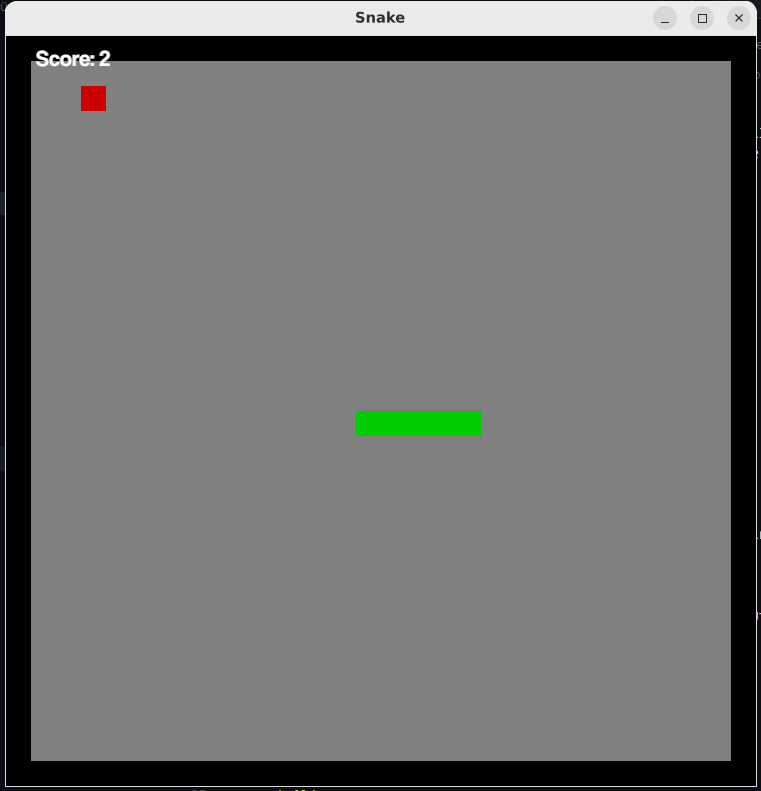

<div id="top"></div>
<br>

<br>

# 🐍 Rust Snake Oyunu

Bu proje, Rust programlama dili kullanılarak geliştirilen bir Snake (Yılan) oyunudur. Oyunda yılan, yön tuşlarıyla kontrol edilir ve ekranda rastgele beliren yiyecekleri yemeye çalışır. Yılanın kendine çarpması veya sınırları aşması durumunda oyun sona erer.

- Yılan, ekran üzerinde blok bazlı hareket eder
- Yemi toplama
- Skor sistemi
- Oyunu duraklama
- Oyun sonu ve yeniden başlatma mekanizması

<p align="right">(<a href="#top">Başa Dön</a>)</p>

## 🚀 Başlangıç

Aşağıdaki adımları takip ederek projeyi yerel ortamınızda çalıştırabilirsiniz.

### Gereksinimler

- Rust'un yüklü olduğundan emin olun. Eğer yüklü değilse aşağıdaki komut ile yükleyebilirsiniz:

```sh
curl --proto '=https' --tlsv1.2 -sSf https://sh.rustup.rs | sh
```

- Gerekli bağımlılıkları yüklemek için aşağıdaki komutu çalıştırın:

```sh
cargo build
```

### Kurulum

1. Depoyu klonlayın:

```sh
git clone https://github.com/kullanici/snake-game.git
```

2. Projeyi derleyin ve çalıştırın:

```sh
cargo run
```

<p align="right">(<a href="#top">Başa Dön</a>)</p>

### Tuş Kombinasyonları

- **Ok Tuşları**: Yılanın yönünü kontrol etme
  - ⬆️ Yukarı
  - ⬇️ Aşağı
  - ⬅️ Sol
  - ➡️ Sağ
- **Boşluk Tuşu**: Oyunu duraklatma/devam ettirme

<p align="right">(<a href="#top">Başa Dön</a>)</p>

## Veri Yapıları

### Block Yapısı

```rust
#[derive(Debug, Clone)]
struct Block {
    x: i32,  // X koordinatı
    y: i32,  // Y koordinatı
}
```

Her bir blok, yılanın ve yemin konumunu temsil eder.

### Yönlendirme Enum'u

```rust
#[derive(Copy, Clone, PartialEq)]
pub enum Direction {
    Up,
    Down,
    Left,
    Right,
}
```

Yılanın hareket yönünü belirleyen enum.

### Yılan Yapısı

```rust
pub struct Snake {
    direction: Direction,  // Mevcut hareket yönü
    body: LinkedList<Block>,  // Yılanın vücut blokları
    tail: Option<Block>,  // Kuyruk bilgisi
}
```

<p align="right">(<a href="#top">Başa Dön</a>)</p>

## 🧩 Temel Metodlar ve İşlevler

### Yılanın Hareketi

`move_forward` metodu, yılanın ilerlemesini sağlar:

- Mevcut yöne göre yeni bir blok oluşturur
- Yeni bloğu başa ekler
- Son bloğu çıkarır

```rust
pub fn move_forward(&mut self, dir: Option<Direction>) {
    // Yön değişikliği varsa güncelle
    match dir {
        Some(d) => self.direction = d,
        None => (),
    }

    // Yeni blok oluşturma
    let new_block = match self.direction {
        Direction::Up => Block { x: last_x, y: last_y - 1 },
        Direction::Down => Block { x: last_x, y: last_y + 1 },
        // Diğer yönler...
    };

    self.body.push_front(new_block);
    let removed_block = self.body.pop_back().unwrap();
    self.tail = Some(removed_block);
}
```

<p align="right">(<a href="#top">Başa Dön</a>)</p>

### Yem Mekanizması

`chek_eating` metodu yem toplama mantığını içerir:

- Yılanın başı yemle aynı konumdaysa
- Yemi yok say
- Yılanın kuyruğunu geri ekle
- Skoru artır

### Grid Sistemi

Oyun, sabit boyutlu bir grid üzerinde çalışır:

- Genişlik ve yükseklik sabit
- Her blok 25x25 piksel
- Sınırların dışına çıkınca oyun biter

### Çizim Metodu

Yılanın ekrana çizilmesi `draw` metodu ile gerçekleştirilir:

```rust
pub fn draw(&self, con: &Context, g: &mut G2d) {
    // Yılanın her bir bloğunu tek tek çiz
    for block in &self.body {
        draw_block(SNAKE_COLOR, block.x, block.y, con, g);
    }
}
```

### Çizim Detayları

- Her blok `draw_block` fonksiyonu ile ayrı ayrı çizilir
- Sabit `SNAKE_COLOR` (yeşil) kullanılır
- Her blok oyunun koordinat sistemine dönüştürülür

### Blok Çizim Fonksiyonu

```rust
pub fn draw_block(color: Color, x: i32, y: i32, con: &Context, g: &mut G2d) {
    // Oyun koordinatını GUI koordinatına dönüştür
    let gui_x = to_coord(x);
    let gui_y = to_coord(y);

    // Belirli boyutta bir dikdörtgen çiz
    rectangle(
        color,
        [gui_x, gui_y, BLOCK_SIZE, BLOCK_SIZE],
        con.transform,
        g,
    );
}
```

<p align="right">(<a href="#top">Başa Dön</a>)</p>

### Temel İşlemler

```rust
pub struct Snake {
    body: LinkedList<Block>,  // Yılanın vücut blokları
}

impl Snake {
    pub fn new(x: i32, y: i32) -> Snake {
        let mut body: LinkedList<Block> = LinkedList::new();

        // Yılanın başlangıç blokları eklenir
        body.push_back(Block { x: x + 2, y });
        body.push_back(Block { x: x + 1, y });
        body.push_back(Block { x, y });

        Snake {
            body,
            // Diğer özellikler...
        }
    }

    // Yem yendiğinde çağrılır
    pub fn restore_tail(&mut self) {
        // Son çıkarılan bloğu geri ekle
        let blk = self.tail.clone().unwrap();
        self.body.push_back(blk);
    }

    // Hareket metodu
    pub fn move_forward(&mut self, dir: Option<Direction>) {
        // Yeni blok başa eklenir
        self.body.push_front(new_block);

        // Son blok çıkarılır
        let removed_block = self.body.pop_back().unwrap();
    }
}
```
