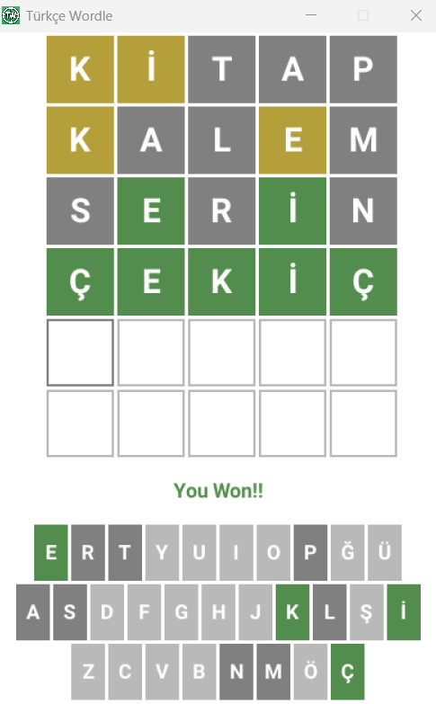

# Türkçe Worldle Oyunu

## Açıklama

Wordle oyunu altı denemede 5 harfli bir kelimeyi tahmin etme oyunudur.
Oyun her tahmin edilen kelime için hedef kelime içerisinde mevcut ama yanlış konumdaki ya da hedef kelime içerisinde mevcut ve doğru konumdaki harfleri farklı renklerde geri bildirimde bulunur.

`hedef kelime içerisinde mevcut ama yanlış konumdaki harf => Sarı`

`hedef kelime içerisinde mevcut ve doğru konumdaki harf => Yeşil`

Eğer tüm harfler hedef kelime içerisinde mevcut ve doğru konumda ise tüm harfler yeşil olur ve oyunu kazanırsınız.
Eğer 6 denemede hedef kelimeyi tahmin edemezseniz oyunu kaybedersiniz.

## Ekran Görüntüsü



## Gereksinimler

- [Go 1.23.1 ya da üstü](https://go.dev/)

## Kullanılan Kütüphaneler

- [Ebitengine V2](https://github.com/hajimehoshi/ebiten)
- [etxt](https://github.com/tinne26/etxt)

## Nasıl Çalıştırılır?

```bash
git clone https://github.com/DTVegaArchChapter/GameProgramming.git
cd GameProgramming/2d-games/wordle/golang
go run main.go
```
