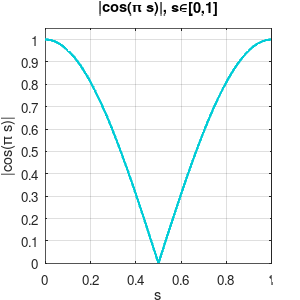

# Türkçe Wordle Oyunu

## Açıklama

Wordle oyunu altı denemede 5 harfli bir kelimeyi tahmin etme oyunudur.
Oyun her tahmin edilen kelime için hedef kelime içerisinde mevcut ama yanlış konumdaki ya da hedef kelime içerisinde mevcut ve doğru konumdaki harfleri farklı renklerde geri bildirimde bulunur.

`hedef kelime içerisinde mevcut ama yanlış konumdaki harf => Sarı`

`hedef kelime içerisinde mevcut ve doğru konumdaki harf => Yeşil`

Eğer tüm harfler hedef kelime içerisinde mevcut ve doğru konumda ise tüm harfler yeşil olur ve oyunu kazanırsınız.

Eğer 6 denemede hedef kelimeyi tahmin edemezseniz oyunu kaybedersiniz.

## Ekran Görüntüsü


## Gereksinimler

- [Go 1.23.1 ya da üstü](https://go.dev/)

## Kullanılan Kütüphaneler

- [Ebitengine V2](https://github.com/hajimehoshi/ebiten) - Game Engine
- [etxt](https://github.com/tinne26/etxt) - Text Rendering

## Nasıl Çalıştırılır?

```bash
git clone https://github.com/DTVegaArchChapter/GameProgramming.git
cd GameProgramming/2d-games/wordle/golang
go run main.go
```

## Neler Öğrendik?

### Game Loop

Ebitengine'de `game loop` inşa etmek için bir `struct` tipi yanımlayıp `ebiten.Game` interface'ini implemente ettikten sonra nesneyi yaratıp `ebiten.RunGame()` fonksiyonuna vermek gerekiyor.

`ebiten.Game` interface'ini implemente etmek için `Update`, `Draw` ve `Layout` fonksiyonlarını tanımlamak gerekmektedir.

- `Layout` fonksiyonu window yeniden boyutlandırıldığında oyunun nasıl ölçekleneceğini belirlemenize izin veren fonksiyondur.
- `Update` fonksiyonu oyun nesnelerinin state'lerinin güncellendiği fonksiyondur. Ebitengine varsayılan olarak `Update` fonksiyonunu saniyede 60 kere çağırır. Bu değer `ebiten.SetTPS` fonksiyonu çağırılarak değiştirilebilir.
- `Draw` fonkisyonu oyun nesnelerinin oyun ekranına çizdirildiği fonksiyondur. Bu fonksiyonun saniyede kaç kere çağırıldığı kullanılan ekranın `HZ` değerine göre belirlenir. Örneğin 60 Hz'lik görüntülemede saniyede 60 kere çağırılır.

```golang
// ebiten.Game interface'ini implemente eder.
type Game struct{}

// İçerisinde Game state'ini güncelleyeceğimiz fonksiyon.
// Update fonksiyonu varsayılan olarak saniyede 60 defa çağırılır.
func (g *Game) Update() error {
    return nil
}

// Draw fonksiyonu içerisinde oyun nesneleri oyun ekranı üzerinde çizdirilir.
// 60 Hz'lik görüntülemede saniyede 60 kere çağırılır
func (g *Game) Draw(screen *ebiten.Image) {

}

// outsideWidth ve outsideHeight window'un boyutlarıdır.
// Sabit bir boyut dönebiliriz ya da outsideWidth ve outsideHeight üzerinden hesaplama yapıp değer dönebiliriz.
// screenWidth, screenHeight ile outsideWidth, outsideHeight farklı olsa bile görüntü window'a sığacak şekilde otomatik olarak ölçeklenir.
func (g *Game) Layout(outsideWidth, outsideHeight int) (screenWidth, screenHeight int) {
    return 320, 240
}

func main() {
    game := &Game{}
    // Ekran boyutu ayarlanır
    ebiten.SetWindowSize(640, 480)
    ebiten.SetWindowTitle("Your game's title")
    // Game loop'u başlatmak için ebiten.RunGame fonksiyonu çağırılır.
    if err := ebiten.RunGame(game); err != nil {
        log.Fatal(err)
    }
}
```

### Grafik

#### Kutu Çizdirme

```golang
func (g *Game) Draw(screen *ebiten.Image) { 
    // ekranın tamamını beyaz renkle doldurur. Normalde ekran siyahtır.
    // ekran üzerinde gösterilecek tüm çizdirme işlemleri screen imajı üzerine yapılır.
    screen.Fill(color.White)

    // kutu boyutu
    size := 40

    // Kutuların başlangıç x ve y koordinatı
    x := 40.
    y := 10.

    // 2 kolon 5 satır kutu çizdiriyoruz
    for row := 0; row < 2; row++ {
        for col := 0; col < 5; col++ {
            // kolonların koordinatlarını satır ve kolon numaralarına göre belirliyoruz. kutular arasında 5 birim boşluk bırakıyoruz.
            rX := x + float64(col*(size+5))
            rY := y + float64(row*(size+5))

            // ebiten.NewImage bizim için boş bir imaj oluşturur
            // bu boş imajın rengini ve kordinatlarını ayarlayıp screen imajı üzerine çizdireğiz
            // dış ve iç olmak üzere 2 dikdörtgen çizdireceğiz. dış dikdörtgenin içi gri renkte, iç dikdörtgenin içi de beyaz renkte olacak. iç dikdörtgenin boyutu, dış dikdörtgenin boyutundan 4 birim az olacak. İç dikdörtgeni, dış dikdörtgenin tam ortasına yerleştireceğiz. böylece ortası beyaz gri çerçeveli bir dikdörtgen elde etmiş olacağız
            outerRect := ebiten.NewImage(size, size)
            // dış dikdörtgenin içini gri renkle dolduruyoruz
            outerRect.Fill(color.RGBA{R: 185, G: 185, B: 185, A: 255})

            // ebiten.DrawImageOptions imajı ekrana çizerken, çizdirilecek imaj üzerinde pozisyon (Translate), öteleme (Scale), döndürme (Rotate) gibi ayarlamalar yapmamızı sağlar.
            outerOpt := &ebiten.DrawImageOptions{}
            // dış dikdörtgeni rX, rY koordinatlarına öteliyoruz
            outerOpt.GeoM.Translate(rX, rY)

            // dış dikdörtgeni ekrana çizdiriyoruz
            screen.DrawImage(outerRect, outerOpt)

            // iç dikdörtgenin boyutunu dış dikdörtgenin boyutundan 4 birim küçük olarak yaratıyoruz. dış dikdörtgenin ortasına yerliştirdiğimizde kenarlarda 2 birim gri çerçeve oluşmuş olacak
            innerRect := ebiten.NewImage(size-4, size-4)
            // iç dikdörtgenin içini beyaz renkle dolduruyoruz
            innerRect.Fill(color.White)

            innerOpt := &ebiten.DrawImageOptions{}
            // iç dikdörtgeni, dış dikdörtgenin ortasına öteliyoruz
            innerOpt.GeoM.Translate(rX+2, rY+2)

            // iç dikdörtgeni ekrana çizdiriyoruz
            screen.DrawImage(innerRect, innerOpt)
        }
    }
}
```

### Animasyon

Bu projede animasyonlar `Tween` altyapısı ile tick bazlı (frame-based) ilerler. Varsayılan TPS=60 olduğu için 0.5 saniyelik bir animasyon süresi `0.5 * 60` tick olarak tanımlanır. `Tween` mantığı `game/tween.go` dosyasındadır.

- Zaman normalizasyonu: `s = elapsed / duration, 0 ≤ s ≤ 1, 0 ≤ elapsed ≤ duration`
- Doğrusal geçiş (LERP): `v(s) = begin + (end - begin) * s`

`Tween.Update(dt)` her tick çağrılır; v(s) hesaplanıp `updateFunc(v)` ile nesnenin durumu güncellenir, bitince `completedFunc()` tetiklenir.

#### Tween

- Dosya: `game/tween.go`
- Fonksiyon: Linear

$$v(t) = b + (e - b)\frac{t}{d}$$

- b: başlangıç, e: bitiş, d: süre (tick), t: geçen tick.
- Kodda: `LinearTweenFunc(elapsed, begin, end, duration)`.

#### Pop

Harf eklendiğinde kutu kısa süre şişer. Dosya: `game/tile.go` → `setRune`.

- Ölçek fonksiyonu:

$$scale(s) = 1 + 0.06\,\sin(\pi s),\quad s\in[0,1]$$

- s = 0 için sin(0) = 0 → scale = 1
- s = 0.5 için sin(π/2) = 1 → scale = 1.06 (tepe)
- s = 1 için sin(π) = 0 → scale = 1 (başlangıç değerine geri döner)

Merkeze göre ölçeklemek için önce merkeze taşı, ölçekle, geri taşı yapılır: `Translate(-m,-m) → Scale(scale, scale) → Translate(m,m)`; burada m = size/2.

Grafik (ölçek - zaman):

```
scale
1.06             ▲
1.03            / \
1.01           /   \
1.00 ─────────┴─────┴────────
           0    0.5    1  (s)
```

##### Trigonometrik Hatırlatma: Sinüs ve Birim Çember

- sin(θ), birim çember üzerinde noktanın y-koordinatıdır.
- Temel değerler: sin(0)=0, sin(π/2)=1, sin(π)=0, sin(3π/2)=-1.

Birim çember – sinüs değerleri y‑ekseninde ölçülür (y=0 çizgisi sin=0’dır):

```
                          sin=+1
                             ↑
                       (0,1) ●   θ=π/2
                             │
                             │
                             │
     sin=0 ← (-1,0) ●────────┼────────● (1,0) → sin=0 
                   θ=π       │        θ=0
                             │
                             │         
                      θ=3π/2 ● (0,-1)
                             ↓
                          sin=-1
```

#### Shake

Geçersiz kelimede kutu yatay olarak sağa ve sola titrer. Dosya: `game/tile.go` → `shake`.

- Konum fonksiyonu (3 tam dalga):

$$x(s) = x_0 + 5\,\sin(3\cdot 2\pi s),\quad s\in[0,1]$$

- Amplitüd 5 px, süre 0.5 s.

Grafik (y ofset):

 − x0 = 5·sin(6πs), s∈[0,1]")

#### Flip

Harf kontrolünde kutu dikey eksende çevrilir. Dosya: `game/tile.go` → `flip`.

- Açı ve ölçek:

$$\quad scale_Y(s) = |\cos(\pi s)|,\quad s\in[0,1]$$

- s=0.5’te scale_Y=0 ile “ince kenar” görünümü, s>0.5’te yüz değişimi yapılır. Kodda `t.flipped = cos(π s) < 0` ile orta noktada arka yüz (renk) devreye girer.
- Uygulanan dönüşümler: `Translate(0, -size/2) → Scale(1, |cos|) → Translate(0, size/2)`.

Grafik:



#### Wave-Like Bounce

Kazanma kutlama animasyonu dalga benzeri zıplamadır. Dosya: `game/tile.go` → `celebrateWin`.

- Dikey ofset:

$$y(s) = y_0 - 10\,\sin(\pi s)$$

- s ∈ [0,1], tepe +10 px, baş/son 0 px.
- Sütuna bağlı gecikme ile dalga etkisi: `appendDelayTween` kullanılır.
  - `DelayWin(c) = (cols - c - 1) · flipDuration + c · bounceDuration`

### Notlar

- `Update()` içinde her tickin başında aktif tween baştan sona güncellenir: ilk eleman `Update(1)` ile ilerler, bittiğinde kuyruktan çıkar.
- Süreler tick cinsindendir; gerçek süre = (tick / TPS).
-  `flip` sırasında renk değişimi tam orta noktada gerçekleşir; `updateBackgroundColor()` `flipped` durumuna göre rengi seçer.
