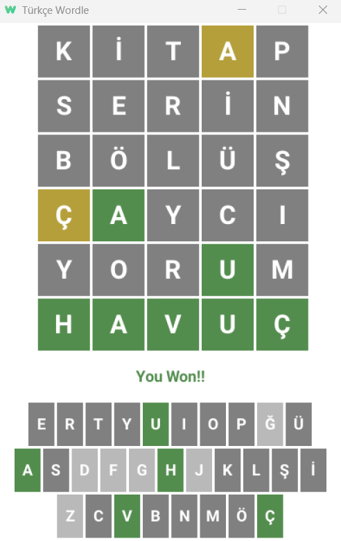

# Türkçe Worldle Oyunu

## Açıklama

Wordle oyunu altı denemede 5 harfli bir kelimeyi tahmin etme oyunudur.
Oyun her tahmin edilen kelime için hedef kelime içerisinde mevcut ama yanlış konumdaki ya da hedef kelime içerisinde mevcut ve doğru konumdaki harfleri farklı renklerde geri bildirimde bulunur.

`hedef kelime içerisinde mevcut ama yanlış konumdaki harf => Sarı`

`hedef kelime içerisinde mevcut ve doğru konumdaki harf => Yeşil`

Eğer tüm harfler hedef kelime içerisinde mevcut ve doğru konumda ise tüm harfler yeşil olur ve oyunu kazanırsınız.
Eğer 6 denemede hedef kelimeyi tahmin edemezseniz oyunu kaybedersiniz.

## Ekran Görüntüsü



## Gereksinimler

- [Go 1.23.1 ya da üstü](https://go.dev/)

## Kullanılan Kütüphaneler

- [Ebitengine V2](https://github.com/hajimehoshi/ebiten)
- [etxt](https://github.com/tinne26/etxt)

## Nasıl Çalıştırılır?

```bash
git clone https://github.com/DTVegaArchChapter/GameProgramming.git
cd GameProgramming/2d-games/wordle/golang
go run main.go
```

## Neler Öğrendik?

### Game Loop

```golang
// ebiten.Game interface'ini implemente eder.
type Game struct{}

// İçerisinde Game state'ini güncelleyeceğimiz fonksiyon.
// Update fonksiyonu varsayılan olarak saniyede 60 defa çağırılır.
func (g *Game) Update() error {
    return nil
}

// Draw fonksiyonu içerisinde oyun nesneleri oyun ekranı üzerinde çizdirilir.
// 60 Hz'lik görüntülemede saniyede 60 kere çağırılır
func (g *Game) Draw(screen *ebiten.Image) {
    // Write your game's rendering.
}

// outsideWidth ve outsideHeight window'un boyutlarıdır.
// Sabit bir boyut dönebiliriz ya da outsideWidth ve outsideHeight üzerinden hesaplama yapabiliriz.
// screenWidth, screenHeight ile outsideWidth, outsideHeight farklı olsa bile görüntü window'a sığacak şekilde otomatik olarak ölçeklenir.
func (g *Game) Layout(outsideWidth, outsideHeight int) (screenWidth, screenHeight int) {
    return 320, 240
}

func main() {
    game := &Game{}
    // Ekran boyutu ayarlanır
    ebiten.SetWindowSize(640, 480)
    ebiten.SetWindowTitle("Your game's title")
    // Game loop'u başlatmak için ebiten.RunGame fonksiyonu çağırılır.
    if err := ebiten.RunGame(game); err != nil {
        log.Fatal(err)
    }
}
```
