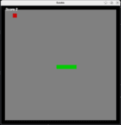

# GameProgramming

Bu repo, çeşitli oyun programlama konularını öğrenmek ve pratik yapmak isteyenler için örnek projeler ve rehberler sunar. Her bir oyun programlama konusu için ayrı dizinlerde örnek projeler bulacaksınız.

## İçerik

- [2D Games](2d-games)
- [3D Games](3d-games)
- [Game Engines](game-engines)
  - [Unity](game-engines/unity)
  - [Unreal Engine](game-engines/unreal)
  - [Godot](game-engines/godot)
- [Algorithms and Patterns](algorithms-and-patterns)
  - [Pathfinding](algorithms-and-patterns/pathfinding)
  - [Procedural Generation](algorithms-and-patterns/procedural-generation)
- [Resources](resources)

## Oyunlar

### Wordle

#### golang

|                     | Wordle                                         |
|---------------------|------------------------------------------------|
| **Geliştirici**     | [Bora Akgün](https://github.com/QuickOrBeDead) |
| **Link**            | [Tıkla](2d-games/wordle/golang)                |
| **Ekran Görüntüsü** |                    |

### Blocks

#### golang

|                     |Blocks                                           |
|---------------------|------------------------------------------------|
| **Geliştirici**     | [Bora Akgün](https://github.com/QuickOrBeDead) |
| **Link**            | [Tıkla](2d-games/blocks/golang)                |
| **Ekran Görüntüsü** |                    |

### Snake

#### rustlang

|                     | Snake                                          |
|---------------------|------------------------------------------------|
| **Geliştirici**     | [Buğra Okumuş](https://github.com/bgraokmush)  |
| **Link**            | [Tıkla](2d-games/snake/rustlang)               |
| **Ekran Görüntüsü** |                     |

## Katkı

Katkıda bulunmak isterseniz, lütfen [CONTRIBUTING.md](CONTRIBUTING.md) dosyasını okuyun.

## Lisans

Bu proje [MIT Lisansı](LICENSE) ile lisanslanmıştır.
